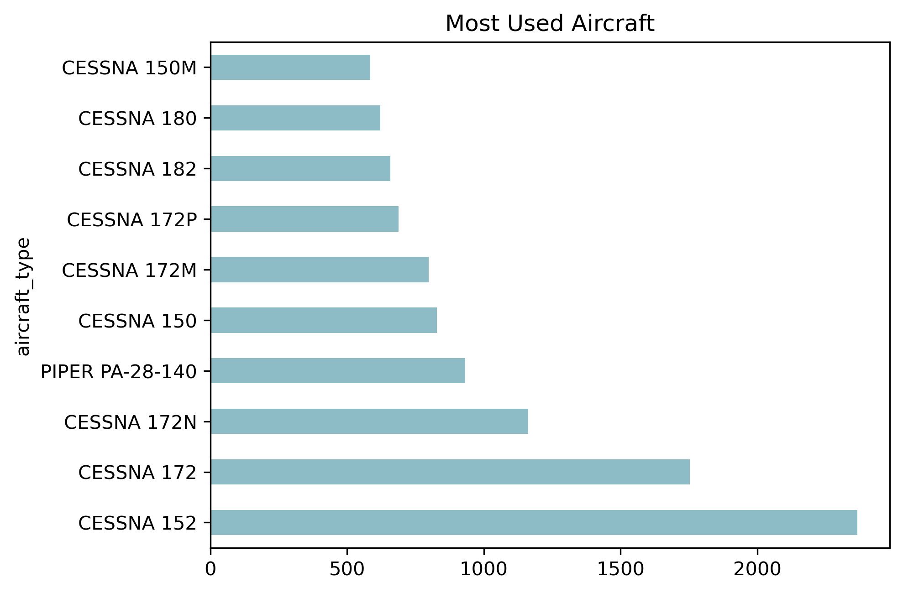
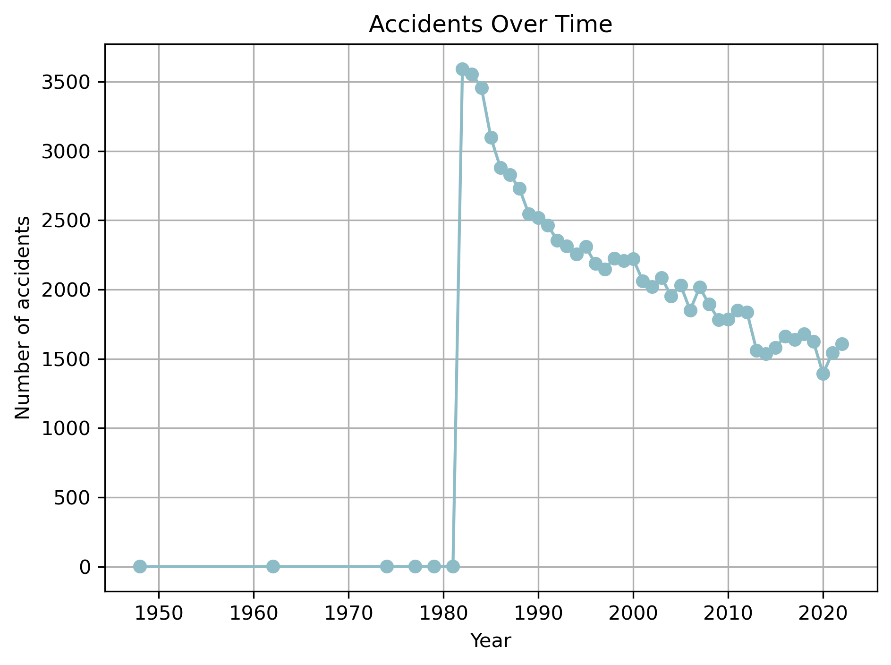
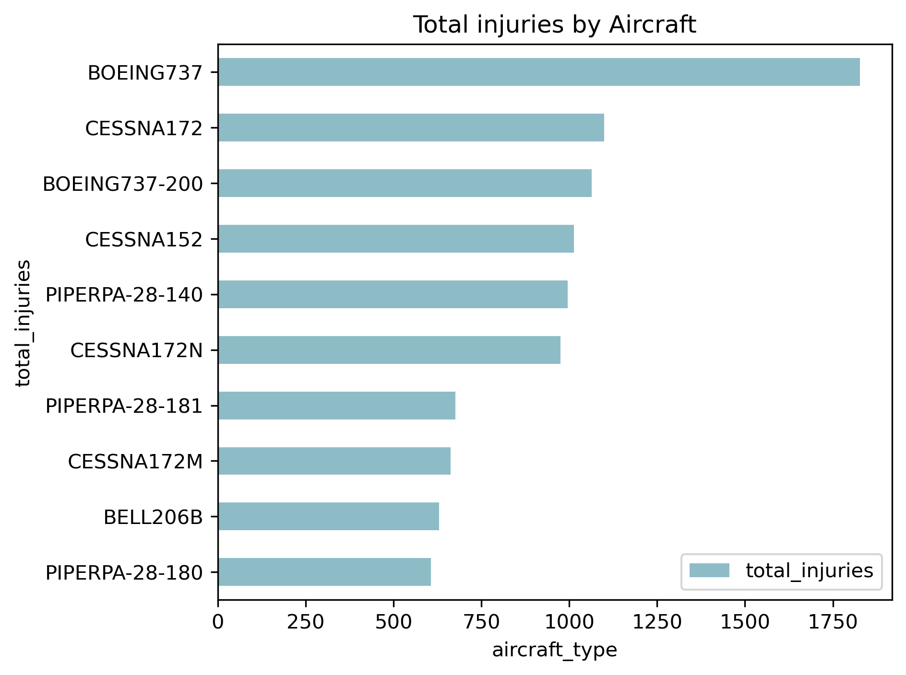

# Aviation project ReadME.md
## Overview
This project provided an analysis of aviation incidents with the goal of identifying the aircraft with the lowest risk for potential business investment. This analysis aims to provide actionable insights into which aircraft would meet the goal.

## Business Understanding
As the company moves into exploring new industries there is a need to analyze the historical data on aviation incidents to identify the aircraft that present the least operational concerns. The goal was to translate the data into clear and actionable recommendations to guide in decision making. 
### stakeholder
The primary stakeholder is the Head of the Aviation Division, responsible for selecting the aircrafts for purchase. 
### key business question
The key business questions include:
* Which aircraft make and model present the lowest accidents and injury profiles?
* What types of aircraft damages are most common and which models are most affected?
* What are the safest aircraft makes and models based on the accident data?
* Which aircraft should be prioritized for purchase to minimize operational risks and maximize passenger safety?
  
## Data Understanding and Analysis
## Source of Data
The dataset was provided by the National Transportation Safety Board. It includes civil aviation accidents and incidents between 1962 to 2023. The data was shared as part of this project and is stored locally in the folder. The file is provided in a CSV format. The dataset includes information on aircraft Make and model, aircraft damage, total injuries(serious, fatal, minor), event date and injury severity.
### Description of Data
the key columns include aircraft Make and model, aircraft damage, total injuries(serious, fatal, minor), event date and injury severity. The data also had a lot of missing values and different variations of the same phrase(eg. 'UNKNOWN', 'Unknown', 'UNK').
Data preparation involved:
- Cleaning and standardizing column names
- handling missing values
- Creating new features and columns (eg. total injury, aircraft type and injury ratio)
### Three visualizations

## Conclusion
A safety metrics table was created based on the data. It includes key measures like total accidents, fatalities, injury severity and aircraft damage levels. This helped standardize comparisons across aircraft types and narrow down safer options. Aircraft with strong safety records across these metrics were shortlisted as potentials.

## Summary
-GRUMMAN-SCHWEIZER G-164A and CESSNA 150D stood out as top performers with
  1. low fatal accident ratios.
  2. low damage rates.
  3. Minimal total fatalities.
- On the other hand the CESSNA 150M appeared at the bottom of the safety ranking, with the high fatality counts and damage ratios, indicating high safety concerns.
- The number of injuries are reducing over time this might be from the technological advancement or even improved safety standards, I would also advice to check on some current models.

Check out the interactive dashboard [here](https://public.tableau.com/app/profile/sharon.k.6258/viz/AviationData_Tableau_17512797979190/Dashboard1?publish=yes)
